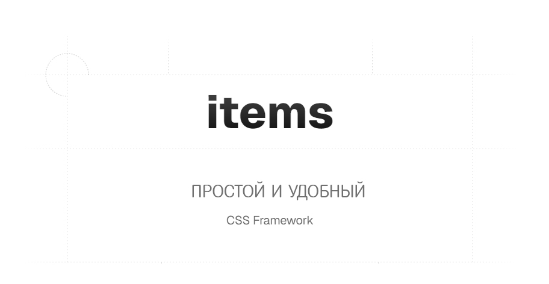

# items.css

## Описание
`items.css` - это CSS-файл, содержащий стили для гибкой и адаптивной сетки, а также набор утилитарных классов для работы с flexbox, отступами и мобильным меню. Простой и удобный css фреймворк для начинающих разработчиков


## Структура файла

### Глобальные настройки
- `box-sizing: border-box` применяется ко всем элементам.
- Определены кастомные CSS-переменные (`--container-max-width`, `--grid-gap-default`, `--color-text` и др.).

### Контейнер и сетка
- `.container` - ограничивает ширину контейнера и добавляет отступы.
- `.row` - контейнер для колонок с поддержкой flexbox.
- `[class*="col-"]` - классы колонок с разной шириной.
- `.col-{n}`, `.col-lg-{n}` - классы для адаптивного изменения ширины колонок (16-колоночная сетка).
- `.col-flex-{n}` - flex-классы для 12-колоночной сетки.

### Flexbox-утилиты
- `.flex` - включает flexbox.
- `.items-{start|center|end|stretch}` - выравнивание элементов.
- `.justify-{start|center|end|between|around}` - управление расположением элементов.
- `.flex-wrap` - разрешает перенос элементов.

### Отступы и gap
- `.gap-{n}` - классы для установки промежутков между элементами (от `0px` до `100px`).

### Мобильное меню
- `.menu` - фиксированное мобильное меню.
- `.item-body`, `.item-logo`, `.item-burger` - стили для структуры меню.
- `.item-menu`, `.item-list`, `.item-link` - стили для списка пунктов меню.
- `.item-menu.active` - показывает меню при активации.

### Медиа-запросы
- `< 576px` - стили для маленьких экранов (скрытие `.item-menu` по умолчанию).
- `< 768px` - стили для планшетов.
- `> 992px` - стили для десктопов (отключение `.item-burger`).

## Использование

### 1. Подключение CSS
```html
<link rel="stylesheet" href="items.css">
```

### 2. Контейнер и сетка
```html
<div class="container">
    <div class="row">
        <div class="col-4">Колонка 1</div>
        <div class="col-8">Колонка 2</div>
    </div>
</div>
```

### 3. Использование Flexbox
```html
<div class="flex">
    <div class="col-flex-6">50%</div>
    <div class="col-flex-6">50%</div>
</div>
```

### 4. Выравнивание элементов
```html
<div class="flex items-center justify-between">
    <div>Левый элемент</div>
    <div>Правый элемент</div>
</div>
```

### 5. Использование отступов
```html
<div class="flex gap-20">
    <div>Элемент 1</div>
    <div>Элемент 2</div>
</div>
```

### 6. Полноэкранное меню
```html
<nav class="menu">
    <div class="item-body">
        <div class="item-logo">Лого</div>
        <div class="item-burger">☰</div>
    </div>
    <ul class="item-menu">
        <li><a class="item-link" href="#">Главная</a></li>
        <li><a class="item-link" href="#">О нас</a></li>
    </ul>
</nav>
```

### 7. Карточки с равномерными отступами
```html
<div class="flex gap-30">
    <div class="item">Карточка 1</div>
    <div class="item">Карточка 2</div>
</div>
```

### 8. Использование `.flex-wrap`
```html
<div class="flex flex-wrap">
    <div class="col-flex-4">Блок 1</div>
    <div class="col-flex-4">Блок 2</div>
    <div class="col-flex-4">Блок 3</div>
</div>
```

### 9. Адаптивные колонки
```html
<div class="row">
    <div class="col-12 col-lg-6">Контент</div>
    <div class="col-12 col-lg-6">Контент</div>
</div>
```

### 10. Кнопки в меню
```html
<ul class="item-list">
    <li><a class="item-link" href="#">Кнопка 1</a></li>
    <li><a class="item-link" href="#">Кнопка 2</a></li>
</ul>
```

